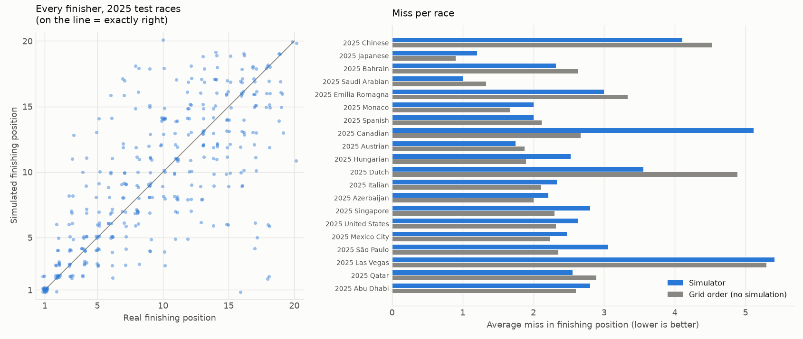
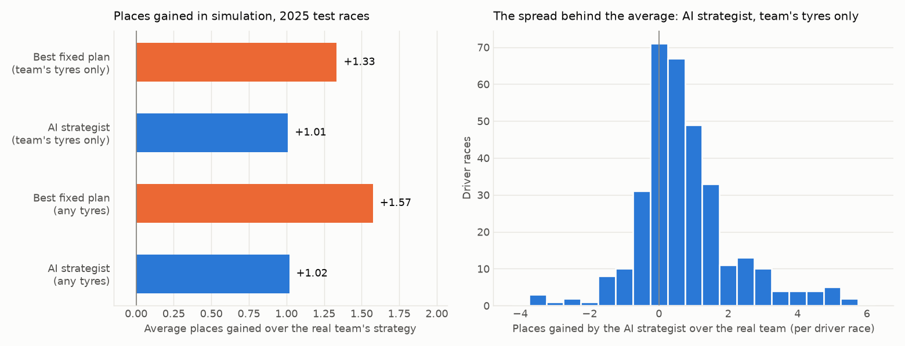

# F1START

An F1 race strategy simulator with an AI strategist. It answers two questions:

- What if the team had pitted differently?
- What would an AI strategist have done?

Built from public timing data only, through the [FastF1](https://docs.fastf1.dev/)
library. Dry races only in this version. Unofficial: not associated with
Formula 1 or any team.

## The short version

- A PyTorch network predicts each lap's time as a range, from tyre compound,
  tyre age, fuel, traffic, car pace and circuit.
- A simulator runs thousands of races side by side on the GPU, with pit
  stops, safety cars, traffic and rivals.
- A brute force search finds the best fixed strategy for any car, and a
  reinforcement learning agent (PPO) decides lap by lap.
- A Streamlit app lets you replay a race, edit a strategy and compare.

What the measurements say, on the 2025 season that nothing was tuned on:

- The lap time model misses a dry racing lap by 0.60s on average, level with
  a LightGBM baseline, and its 90% ranges contain 90.8% of real laps.
- Replaying real races, the simulator picks the winner in 18 of 19 races,
  but its full finishing order is no better than assuming grid order.
- The AI strategist does not beat brute force.
- Both "beat" real teams by about a place in simulation. Most of that is
  the simulator's own bias, which is measured and explained below.

## How it works

Seasons are split by time: models learn from 2022 to 2023, every choice is
made on 2024, and 2025 is touched once at the end after retraining on 2022
to 2024.

1. **Race model.** Lap time is split into the race's overall pace level and
   each lap's pace within the race. A network predicts the second part as a
   centre and a spread. Pit lane loss per circuit and safety car likelihood
   are measured from past seasons.
2. **Simulator.** Each lap, every car in every simulated race gets a lap
   time from the network plus luck, then pit loss, traffic and safety car
   rules are applied. It is wrapped as a Gymnasium style environment.
3. **AI strategist.** A PPO agent controls one car; the other 19 follow
   their real strategies. Each lap it stays out or pits for a compound.
4. **Website.** A Streamlit app that runs on a small CPU-only server.

[docs/MAP.md](docs/MAP.md) shows how the files connect.
[docs/DECISIONS.md](docs/DECISIONS.md) records every significant decision
and why. [docs/INTERVIEW_GUIDE.md](docs/INTERVIEW_GUIDE.md) explains each
part in plain English.

## Results

Every number comes from a script in this repository. "2024" is the
validation season, used for choices. "2025" is the test season.

### 1. Lap time models

Average miss in seconds per lap on clean racing laps. Dry races are the
headline because this version does not model rain.

| Model | 2024 dry, mean | 2024 dry, median | 2025 dry, mean | 2025 dry, median |
|---|---|---|---|---|
| Know-nothing (every lap is the race's typical lap) | 1.044 | 0.884 | | |
| LightGBM baseline | 0.632 | 0.451 | **0.588** | **0.440** |
| Neural network | **0.619** | **0.435** | 0.603 | 0.452 |

The network and the baseline are level: the network was 2% better on 2024
and 3% worse on 2025. The network is used because it predicts a range and
runs on the GPU inside the simulator.

Are its ranges honest? Share of dry laps inside the predicted 90% range:

| | Straight from the network | After one widening factor (1.145, fitted on 2024) |
|---|---|---|
| 2024 | 86.6% | 90.0% (by construction) |
| 2025 | 87.3% | **90.8%** |

### 2. Pit stops and safety cars (measured on 2022 to 2023)

- Pit lane loss under green: 18.8s (Spa) to 27.4s (Lusail), from 767 stops.
- A stop costs 49% of that under a safety car and 65% under a VSC.
- Chance of a safety car starting, per lap: 7.1% in laps 1 to 3, about 1%
  early, 0.7% later. From only 19 safety car periods, so these are rough.

### 3. Replay validation

Each dry race is simulated 200 times with the real grid, real strategies
and real safety cars, then compared with the real result. The simulator is
told each driver's qualifying gap but nothing about their real race pace.
The yardstick is "everyone finishes where they started".

| | 2024 (18 races) | 2025 (19 races) |
|---|---|---|
| Simulator: average miss in finishing position | **2.09** | 2.60 |
| Grid order: average miss | 2.43 | **2.45** |
| Winner right | 11 of 18 | 18 of 19 |
| Podium places right | 38 of 54 | 42 of 57 |
| Real results inside the simulated 90% range | 88% | 78% |
| Median miss in gap to the winner | 16.7s | 10.3s |

On 2024 the simulator beat grid order by 14%. On 2025 it did not. Two of its
rules were chosen on 2024, and that advantage did not carry over.



### 4. Strategy: brute force and the AI strategist against real teams

For every finisher of every dry race, three strategies are simulated in the
same 200 versions of the real race: the team's real one, the best fixed plan
from a brute force search over about 1,000 plans, and the AI strategist.
Both alternatives may only fit the tyre compounds that team really used in
that race (why: next section). Positive means better than the team.

| | 2024 places gained | 2024 seconds gained | 2025 places gained | 2025 seconds gained |
|---|---|---|---|---|
| Best fixed plan | 1.46 | 10.5 | 1.33 | 8.2 |
| AI strategist | 1.21 | 8.1 | 1.01 | 6.0 |

- **The AI strategist does not beat brute force** in either season.
- In 2024 races with a safety car or VSC the two were level (1.20 places
  each). In 2025 brute force was ahead there too (1.33 against 1.01).
- The strategist does worse than the real team in 12% of driver races in
  2024 and 18% in 2025.

345 driver races in 2024 and 350 in 2025, after leaving out drivers whose
real race included a stop forced by damage.



### 5. Simulator flaws the optimisers exploited

The first brute force run said fixed plans beat real teams by 2.06 places in
90% of driver races. That is not believable, so it was investigated.

- **Soft tyres are overrated.** The winning plans spent five times as many
  laps on softs as real teams. Compound names are relative (Pirelli brings a
  different three of its five compounds to each race, and the public data
  does not say which), teams only run softs where they last, and softs were
  raced more in the training seasons than in 2024.
- **Extra stops are undervalued.** Drivers nurse tyres on long stints, so the
  data makes long stints look cheap.
- **The simulator cannot see** tyre sets available, damage, penalties, team
  orders or covering a rival.

What was done: a guard on tyre age was tightened (this changed the gain from
2.06 to 2.08 places, so it was not the main cause), and the comparison was
restricted to the compounds each team really used (2.08 to 1.46 places).
Allowed any compound, the numbers are 2.08 places for brute force and 1.66
for the strategist in 2024, and 1.57 and 1.02 in 2025.

**So "places gained over real teams" is not "what teams left on the table".**
It mixes real inefficiency with simulator bias. The comparison between
brute force and the strategist, inside the same simulator, is the reliable
part.

## What worked, what didn't

Worked:

- Splitting lap time into race level and within-race pace. The first model
  without it was worse than guessing the average (2.63s against 2.09s).
- A time-based three-way split, with 2025 held back. Several results got
  worse on 2025, which is exactly what the split is for.
- One-factor calibration of the network's ranges held up on 2025.
- Vectorising the simulator: about 1,000 strategies for one car in 3 to 5
  seconds, and PPO training at about 2,300 simulated races per second.
- Treating a result that looked too good as a bug to investigate.

Did not work:

- The network did not clearly beat gradient boosting.
- The simulator did not beat grid order at predicting finishing order on
  2025.
- The AI strategist did not beat brute force.
- Temperatures as model inputs made predictions worse.

## Limitations

- Dry races without red flags only. Rain, double stacking and starting tyre
  choice are not modelled.
- The race pace level is taken from the race itself, so the simulator
  replays races that happened; it does not forecast a race before it starts.
  Forecasting that level from earlier seasons misses by 0.38s a lap in the
  median and far more after wet qualifying.
- Tyre compounds are relative names, and tyre management is not modelled,
  which biases the simulator towards softs and fewer stops.
- Rivals follow their real strategies and only react to safety cars with a
  simple rule. They do not respond to what the studied car does.
- Overtaking, the first lap and safety car bunching are simple rules.
- Safety car statistics rest on about 20 periods.
- Miami 2025 is missing (no qualifying times in the data source).

## How to run it

The website needs only Python 3.12 and no GPU:

```powershell
py -3.12 -m venv .venv
.venv\Scripts\python.exe -m pip install -r requirements.txt
.venv\Scripts\python.exe -m streamlit run app.py
```

To rebuild everything from the data (needs an NVIDIA GPU for reasonable
speed; RTX 50 series cards need a PyTorch build for CUDA 12.8 or newer):

```powershell
py -3.12 -m venv .venv
.venv\Scripts\python.exe -m pip install torch==2.14.1 --index-url https://download.pytorch.org/whl/cu130
.venv\Scripts\python.exe -m pip install -r requirements-dev.txt

.venv\Scripts\python.exe check_gpu.py            # proves training runs on the GPU
.venv\Scripts\python.exe download_data.py        # about 3 hours (rate limited)
.venv\Scripts\python.exe clean_data.py
.venv\Scripts\python.exe train_baseline.py       # LightGBM baseline, scored on 2024
.venv\Scripts\python.exe train_network.py        # the lap time network
.venv\Scripts\python.exe race_stats.py           # pit loss and safety car statistics
.venv\Scripts\python.exe replay_validation.py    # replay the 2024 races
.venv\Scripts\python.exe strategy_search.py      # brute force on 2024, about 25 minutes
.venv\Scripts\python.exe train_agent.py          # the PPO strategist, about 5 minutes
.venv\Scripts\python.exe evaluate_strategist.py  # strategist against teams on 2024
.venv\Scripts\python.exe final_test.py           # the one-off 2025 test (already run)
.venv\Scripts\python.exe -m pytest               # 38 tests
```

## Hardware used

Intel Core Ultra 7 255HX, 32 GB RAM, NVIDIA RTX 5070 Ti Laptop GPU (12 GB),
PyTorch 2.14.1 with CUDA 13.0.
