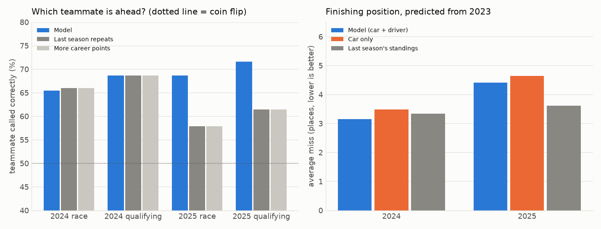

# F1-EQUALIZER

If every Formula 1 driver in history drove the same car, who would be fastest?

F1 results mix two things: how good the driver is and how good the car is.
This project separates them with a statistical model built on teammate
comparisons (teammates share the same car), linked across eras through shared
teammates. It then simulates races where every car is identical, and a website
lets you race drivers from any era against each other.

**Status: in progress.** The data and the model are done and validated. The
simulation and the website are next.

| Phase | What | Status |
|---|---|---|
| 1 | Data: results since 1950, lap times since 2018, circuit outlines | done |
| 2 | The model: driver skill separated from car performance, validated on 2024 and 2025 | done |
| 3 | The simulation: equal car races on the GPU | not started |
| 4 | The website (Next.js, free on Vercel) | not started |

## Data

Public data only:

- [Jolpica F1 API](https://github.com/jolpica/jolpica-f1) (the successor to
  Ergast): every race and qualifying result since 1950.
- [FastF1](https://github.com/theOehrly/Fast-F1): lap times and track
  coordinates for 2018 onwards.

What the cleaned data holds (downloaded 2026-10-09, printed by
`clean_history.py` and `clean_laps.py`):

| Decade | Seasons | Races | Drivers | Starts | Car failure | Driver error | Teammate pairs | Pairs with a comparable race |
|---|---|---|---|---|---|---|---|---|
| 1950s | 10 | 84 | 307 | 1,834 | 36.6% | 8.0% | 2,809 | 1,120 |
| 1960s | 10 | 100 | 192 | 1,899 | 40.1% | 6.5% | 1,906 | 698 |
| 1970s | 10 | 144 | 153 | 3,427 | 32.7% | 12.3% | 2,222 | 937 |
| 1980s | 10 | 156 | 103 | 3,920 | 39.6% | 12.8% | 1,686 | 662 |
| 1990s | 10 | 162 | 96 | 3,860 | 30.6% | 17.3% | 1,844 | 940 |
| 2000s | 10 | 174 | 71 | 3,611 | 19.0% | 11.5% | 1,798 | 1,185 |
| 2010s | 10 | 198 | 66 | 4,265 | 10.2% | 7.3% | 2,118 | 1,674 |
| 2020s | 7 | 147 | 40 | 2,945 | 3.0% | 3.0% | 1,460 | 1,165 |
| **All** | **77** | **1,165** | **789** | **25,761** | | | **15,843** | **8,381** |

- 643 of the 655 drivers who ever had a teammate are linked to each other
  through chains of shared teammates. That link is what allows drivers from
  different eras to be compared.
- Lap times: 163,011 clean racing laps from 183 races since 2018.
- Track outlines: 33 circuits.

Known weaknesses of the data (details in
[docs/DECISIONS.md](docs/DECISIONS.md), number 14):

- From 2023 the source no longer says why a car retired, so those races are
  left out of teammate comparisons. A driver's own crashes therefore stop
  counting against them from 2023, which includes both test seasons. (This
  is why the 2020s row shows only 3% for each cause.)
- Before 1990 cars broke down in more than a third of starts, so well under
  half of teammate pairs give a usable race result.
- Before 1970 a "constructor" often means a car maker that sold to private
  owners, so some "teammates" did not have equal cars.
- "Collision" counts as a driver error even when the other driver caused it.
- Qualifying lap times only exist from 1994, and are patchy from 1996 to 2002.

## How to run it

```
.venv\Scripts\python.exe check_gpu.py           # once: proves PyTorch trains on the GPU
.venv\Scripts\python.exe -m pytest              # the tests

.venv\Scripts\python.exe download_history.py    # 1. results since 1950 (about 15 minutes)
.venv\Scripts\python.exe clean_history.py       # 2. results and teammate pairs
.venv\Scripts\python.exe download_laps.py       # 3. lap times since 2018 (several hours)
.venv\Scripts\python.exe clean_laps.py          # 4. pace and consistency per race
.venv\Scripts\python.exe download_circuits.py   # 5. track outlines (about 10 minutes)

.venv\Scripts\python.exe validate_model.py      # 6. fit to 2023, test on 2024 and 2025 (1 minute)
.venv\Scripts\python.exe fit_ratings.py         # 7. final ratings from all data (30 seconds)
```

The steps of each phase are listed in [docs/MAP.md](docs/MAP.md), in the order
they run. Each decision and its reason is in
[docs/DECISIONS.md](docs/DECISIONS.md).

## How the model works

- Every driver gets a skill number for every season they raced, measured in
  percent of lap time: +0.5 means half a percent quicker than an average
  newcomer of today in the same car (about 0.45 seconds a lap).
- The model only ever compares teammates, so the car cancels out. For each
  pair in each race it looks at who finished ahead, the qualifying lap time
  gap (from 1994) and the race pace gap (from 2018).
- Races that ended with a car failure are left out, so breakdowns never count
  against a driver.
- It is a Bayesian hierarchical model: drivers are assumed to come from one
  population, so a driver with three races is pulled towards average, and
  each season's skill is tied to the season before.
- It is fitted on the GPU in about 15 seconds. The uncertainty of every
  rating comes from how sharply the fit worsens when that rating is moved
  (a Laplace approximation). Drivers with few races, few teammates or from
  older eras get wider ranges: a typical 1950s peak rating is uncertain by
  0.30%, a 2020s one by 0.16%.

The code is [model.py](model.py). The reasoning is in
[docs/DECISIONS.md](docs/DECISIONS.md), numbers 15 to 20.

## Results

Everything below is printed by `validate_model.py`. The model was fitted on
results up to the end of 2023 and then predicted 2024 and 2025 without being
refitted. Its two settings were chosen on 2022 and 2023 only.



**Which teammate is ahead?** (share called correctly)

| | Comparisons | Model | More career points | Last season repeats, else career points |
|---|---|---|---|---|
| 2024 race | 191 | 65.4% | 66.0% | 66.0% |
| 2025 race | 185 | **68.6%** | 57.8% | 57.8% |
| Both, race | 376 | **67.0%** | 62.0% | 62.0% |
| 2024 qualifying | 236 | 68.6% | 68.6% | 68.6% |
| 2025 qualifying | 236 | **71.6%** | 61.4% | 61.4% |
| Both, qualifying | 472 | **70.1%** | 65.0% | 65.0% |

- In 2024 the model only matched the baselines. Nearly every team kept its
  2023 drivers, so "last season repeats" was hard to beat.
- In 2025 many drivers changed team or were new. The baselines fell and the
  model did not. What it adds is comparing drivers who were never teammates.
- On the 223 race comparisons where the pair were also teammates the season
  before, the model (66.4%) is no better than "last season repeats" (66.8%).
- One season is about 190 race comparisons, so a season's accuracy is only
  good to about plus or minus 7 points.

**Are the probabilities honest?** (race, 2024 and 2025 together)

| Model said the favourite had | Comparisons | Favourite really won |
|---|---|---|
| 50 to 60% (average 55.0%) | 145 | 55.2% |
| 60 to 70% (average 66.3%) | 119 | 61.3% |
| 70 to 80% (average 74.1%) | 73 | 82.2% |
| 80% or more (average 81.6%) | 39 | 100.0% |

The model is too cautious about clear favourites.

**Finishing positions**, predicted using only information up to 2023
(average miss in places among the cars that finished):

| | Model (car + driver) | Car only | Last season's standings |
|---|---|---|---|
| 2024 | **3.15** | 3.48 | 3.34 |
| 2025 | 4.41 | 4.64 | **3.61** |

Adding driver skill to the car helps in both years. But for 2025 the model is
worse than last season's standings, because it is still using 2023 cars while
that baseline has seen 2024.

**Weaknesses of the model**

- Cross-era comparisons cannot be validated. There is no test for Senna
  against Verstappen; only the modern end is checked.
- How much the level of F1 drivers changed between decades is an assumption
  (0.1% per decade), not a measurement. It directly sets how wide the ranges
  of older drivers are.
- A driver is only ever measured against their teammates. A driver whose
  teammates were all weak, or who was a clear team number one or two, can be
  misjudged. Heinz-Harald Frentzen ranking 9th of all time is probably an
  example of this.
- The rating is a driver's best three seasons in a row, which flatters
  everyone slightly and long careers most.
- The uncertainty ranges are somewhat too narrow by construction (see
  DECISIONS.md, number 15).

## The earlier project

This repository used to hold an F1 race strategy simulator. It is kept in
[archive/](archive/README.md).
